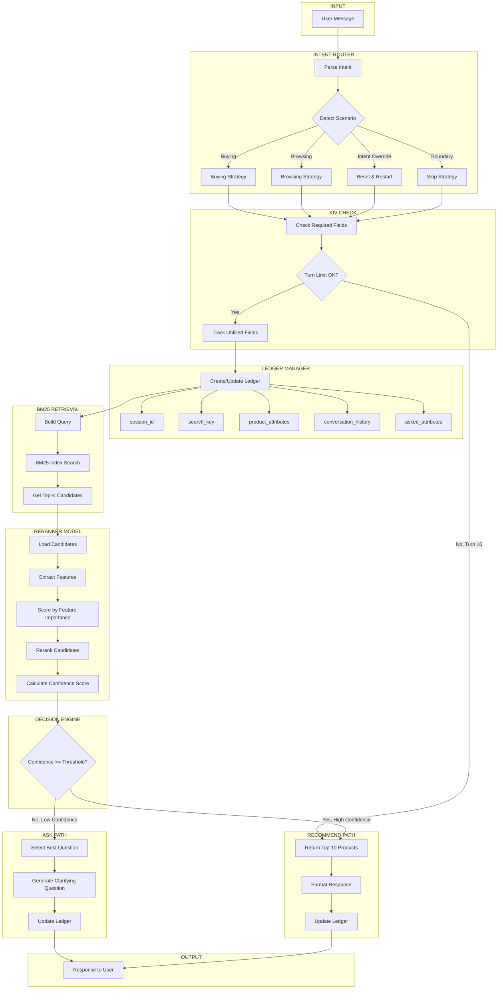
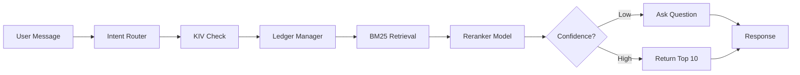
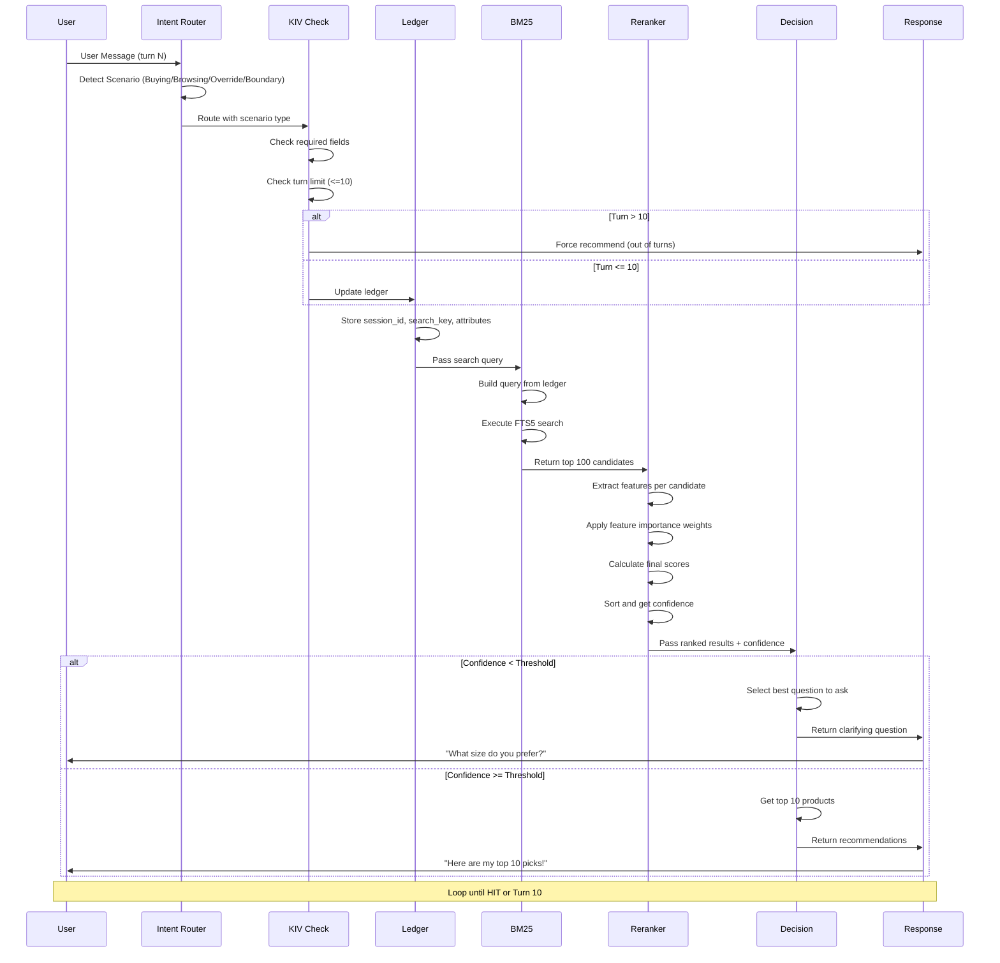
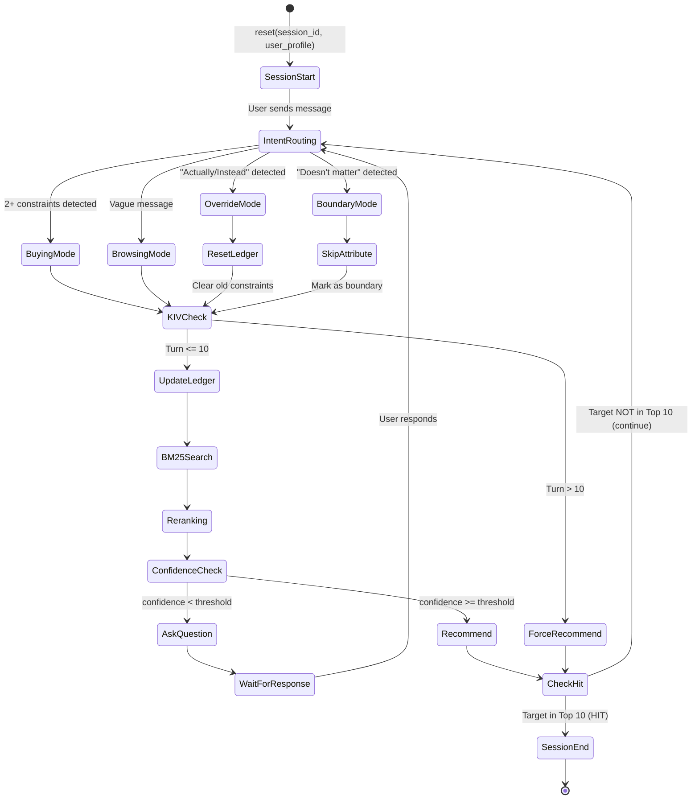
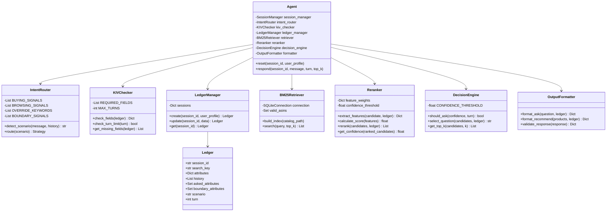

# CONVERSATIONAL SHOPPING AGENT - ARCHITECTURE

## Overview

This document describes the architecture for the TechJam Conversational Shopping Agent. The agent finds a hidden target product by asking smart clarifying questions and searching a 50,000 product catalog within 10 turns.

---

## System Flow

```
User Message
    |
    v
+------------------+
|  Intent Router   |  <- Detect: Buying/Browsing/Override/Boundary
+------------------+
    |
    v
+------------------+
|   KIV Check      |  <- Check fields to fill, limit turns
+------------------+
    |
    v
+------------------+
|  Ledger Manager  |  <- session_id, search_key, attributes
+------------------+
    |
    v
+------------------+
| BM25 Retrieval   |  <- Get top 100 candidates
+------------------+
    |
    v
+------------------+
| Reranker Model   |  <- Score by feature importance
+------------------+
    |
    v
+------------------+
| Decision Engine  |  <- Confidence >= threshold?
+------------------+
   /         \
  v           v
 ASK       RECOMMEND
Question    Top 10
```

---

## Main Architecture Diagram



---

## Simplified Linear Flow



---

## Sequence Diagram



---

## State Machine Diagram



---

## Component Class Diagram



---

## Component Descriptions

### 1. Intent Router
**Purpose:** Detect customer scenario and route to appropriate strategy

| Scenario | Detection Signal | Strategy |
|----------|-----------------|----------|
| Buying (40%) | 2+ explicit constraints | Efficient, ask high-impact questions only |
| Browsing (40%) | Vague message | Discovery, guide with exploratory questions |
| Intent Override (15%) | "Actually", "Instead" keywords | Reset constraints, restart search |
| Boundary (5%) | "Doesn't matter", "I don't know" | Skip attribute, move to next |

### 2. KIV Check
**Purpose:** Track required fields and turn limits

- **Required Fields:** category, size, color, budget, material, use_case
- **Max Turns:** 10
- **Logic:** If turn > 10, force recommend regardless of confidence

### 3. Ledger Manager
**Purpose:** Maintain session state

```python
Ledger = {
    'session_id': 'abc123',
    'search_key': 'running shoes comfort',
    'attributes': {
        'category': 'shoes',
        'use_case': 'running',
        'size': 10,
        'color': None,
        'budget': None
    },
    'history': [...],
    'asked_attributes': {'category', 'size'},
    'boundary_attributes': set(),
    'scenario': 'buying',
    'turn': 3
}
```

### 4. BM25 Retrieval
**Purpose:** Fast keyword-based search

- Uses SQLite FTS5 for full-text search
- Indexes: title, categories, features, details, store, description
- Returns top 100 candidates with BM25 scores

### 5. Reranker Model
**Purpose:** Score and rerank candidates by feature importance

**Features extracted:**
- BM25 score (from retrieval)
- Attribute match score (how well product matches constraints)
- User preference match (alignment with user_profile.preference_tags)
- Product rating (average_rating)
- Price relevance (if budget constraint exists)

**Feature weights (tunable):**
```python
weights = {
    'bm25_score': 0.30,
    'attribute_match': 0.25,
    'preference_match': 0.20,
    'rating': 0.15,
    'price_relevance': 0.10
}
```

**Confidence calculation:**
```python
confidence = top_1_score - top_2_score  # Score gap
# High confidence = large gap between #1 and #2
```

### 6. Decision Engine
**Purpose:** Decide whether to ask or recommend

```python
def decide(confidence, candidate_count, turn):
    if turn >= 10:
        return 'recommend'  # Out of turns
    
    if confidence >= THRESHOLD:
        return 'recommend'  # High confidence
    
    if candidate_count < 50:
        return 'recommend'  # Narrowed enough
    
    return 'ask'  # Need more info
```

**Threshold:** 0.6 (tunable)

---

## Data Flow

```
INPUT:
  session_id: 'abc123'
  user_message: 'I want running shoes'
  turn: 1
  user_profile: {preference_tags: ['comfort', 'fit']}

    |
    v

LEDGER:
  session_id: 'abc123'
  search_key: 'running shoes comfort fit'
  attributes: {category: 'shoes', use_case: 'running'}

    |
    v

RETRIEVAL:
  query: 'running shoes comfort fit'
  candidates: [{asin: 'B001', score: 95}, {asin: 'B002', score: 92}, ...]
  count: 100

    |
    v

RERANKER:
  features: {bm25: 0.95, attr_match: 0.80, pref_match: 0.70, rating: 4.5}
  final_score: 0.82
  confidence: 0.15 (low - scores are close)

    |
    v

DECISION:
  confidence (0.15) < threshold (0.6)
  action: ASK

    |
    v

OUTPUT:
  message: 'What size do you wear?'
  ask_attribute: 'size'
  recommendations: []
  usage: {prompt_tokens: 0, completion_tokens: 0}
```

---

## Scenario Strategies

### Buying (40%)
```
Turn 1: "I need black running shoes size 10"
  -> Extract: color=black, use_case=running, size=10
  -> Candidates: 45 (narrowed)
  -> Confidence: HIGH
  -> Action: RECOMMEND top 10
```

### Browsing (40%)
```
Turn 1: "I want something comfortable"
  -> Extract: (vague)
  -> Candidates: 2000+ (broad)
  -> Confidence: LOW
  -> Action: ASK "What type? Shoes, jacket, or socks?"

Turn 2: "Shoes"
  -> Extract: category=shoes
  -> Candidates: 500
  -> Confidence: LOW
  -> Action: ASK "For what use? Running, casual, formal?"

Turn 3: "Casual"
  -> Extract: use_case=casual
  -> Candidates: 80
  -> Confidence: MEDIUM
  -> Action: ASK "What size?"

Turn 4: "Size 10"
  -> Candidates: 35
  -> Confidence: HIGH
  -> Action: RECOMMEND top 10
```

### Intent Override (15%)
```
Turn 1-2: Building constraints for "black running shoes"
Turn 3: "Actually, I need white hiking boots instead"
  -> DETECT: Intent changed!
  -> RESET: Clear all constraints
  -> Extract new: color=white, use_case=hiking, type=boots
  -> Continue efficiently (only 7 turns left)
```

### Boundary (5%)
```
Turn 1: "I want shoes"
Turn 2: Agent asks "What color?"
        Customer: "Doesn't matter"
  -> DETECT: Boundary on color
  -> SKIP: Don't add color constraint
  -> ASK: Next attribute "What size?"
```

---

## API Contract

### Input (reset)
```python
def reset(session_id: str, user_profile: dict) -> None:
    """
    user_profile = {
        'purchase_frequency': '3-4 prior purchases',
        'average_prior_rating': 5.0,
        'rating_style': 'usually positive',
        'preference_tags': ['fit', 'comfort', 'durability'],
        'summary': '...'
    }
    """
```

### Input (respond)
```python
def respond(session_id: str, user_message: str, turn: int, top_k: int) -> dict:
    """
    turn: 1-10
    top_k: always 10
    """
```

### Output
```python
{
    'message': str,           # Natural language response
    'ask_attribute': str|None,  # One of: category, material, color, size, 
                                #         style, brand, budget, feature, 
                                #         use_case, other, or null
    'recommendations': [
        {'parent_asin': 'B001...'},
        {'parent_asin': 'B002...'},
        # ... up to 10
    ],
    'usage': {
        'prompt_tokens': int,
        'completion_tokens': int
    }
}
```

---

## Metrics

| Metric | Formula | Weight |
|--------|---------|--------|
| Hit Rate@10 | successful_sessions / total_sessions | 50% |
| MRR | mean(1/target_rank, miss=0) | 30% |
| Efficiency | clip((11 - MTTC) / 10, 0, 1) | 20% |

**Technical Score = 0.50 x HitRate@10 + 0.30 x MRR + 0.20 x Efficiency**

### Targets

| Metric | Baseline | Target | Stretch |
|--------|----------|--------|---------|
| Hit Rate | 12.5% | 40% | 60%+ |
| MRR | 0.068 | 0.20 | 0.35+ |
| MTTC | 9.81 | 5.0 | 3.0 |

---

## Implementation Phases

### Phase 1: Foundation (3-4 hours)
- [ ] Session/Ledger Manager
- [ ] BM25 Retrieval (use starter code)
- [ ] Basic Decision Engine (candidate count threshold)
- [ ] Output Formatter

### Phase 2: Intent & Extraction (2-3 hours)
- [ ] Intent Router (detect scenario)
- [ ] Attribute Extractor (keywords + regex)
- [ ] KIV Checker (field tracking)

### Phase 3: Reranking (2-3 hours)
- [ ] Feature extraction
- [ ] Feature importance scoring
- [ ] Confidence calculation

### Phase 4: Optimization (2-4 hours)
- [ ] Tune confidence threshold
- [ ] Tune feature weights
- [ ] Handle edge cases
- [ ] Test on all 200 public sessions

---

## File Structure

```
techjam-conversational-search/
├── data/
│   ├── catalog.jsonl          # 50,000 products
│   └── public_set.jsonl       # 200 test sessions
├── docs/
│   ├── architecture.md        # This file
│   ├── agent_api_contract.json
│   └── competition_specification.md
├── starter/
│   └── agent.py               # Baseline BM25 agent
├── src/                       # Your implementation
│   ├── agent.py               # Main orchestrator
│   ├── intent_router.py
│   ├── kiv_checker.py
│   ├── ledger_manager.py
│   ├── retriever.py
│   ├── reranker.py
│   ├── decision_engine.py
│   └── output_formatter.py
├── evaluator/
│   └── local_evaluator.py
└── results.json               # Evaluation output
```
